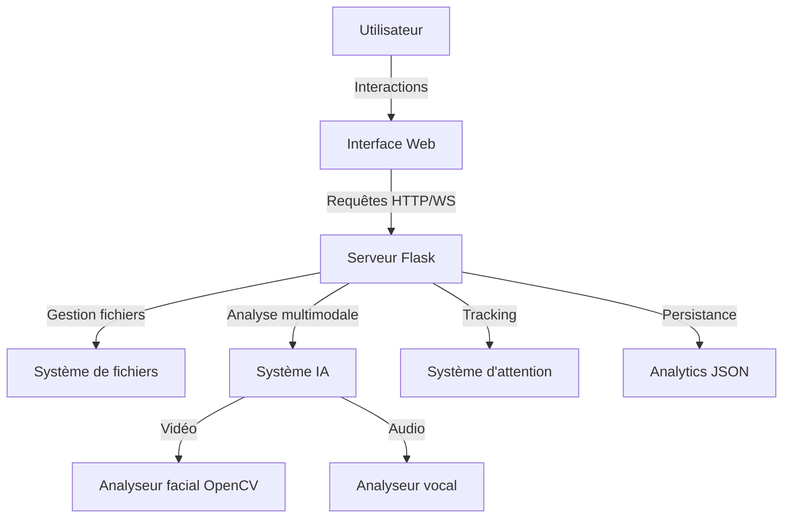
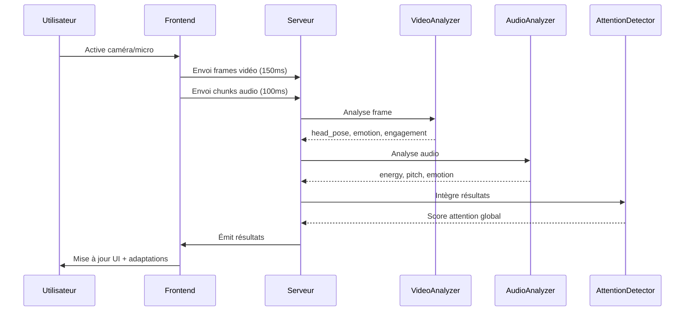
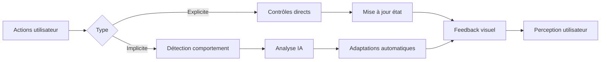

# Architecture du Lecteur Musical Intelligent

## Vue d'ensemble de l'application

Le **Lecteur Musical Intelligent** est une application web innovante qui combine lecture audio classique et intelligence artificielle pour créer une expérience d'écoute adaptative. L'application analyse en temps réel l'attention de l'utilisateur via webcam et microphone pour adapter automatiquement la lecture musicale et l'interface utilisateur.

### Objectifs principaux
- Offrir une expérience d'écoute personnalisée et adaptative
- Détecter et réagir au niveau d'attention de l'utilisateur
- Fournir des analyses comportementales pour améliorer l'engagement
- Créer une interface moderne et immersive

---

## Architecture Fonctionnelle

### Composants principaux



### Fonctionnalités clés

#### 1. Lecture musicale
- Support multi-formats (MP3, WAV, OGG, M4A, FLAC)
- Contrôles standards (play/pause, suivant/précédent, progression)
- Modes shuffle et repeat
- Gestion de playlist dynamique

#### 2. Détection d'attention
- Analyse vidéo en temps réel (position tête, émotion faciale)
- Analyse audio vocal (énergie, émotion)
- Calcul de score d'engagement (0-100)
- Adaptation automatique basée sur l'attention

#### 3. Adaptation intelligente
- Changement automatique de musique si attention basse
- Ajustement du volume selon l'engagement
- Modification de l'intensité UI selon le contexte
- Recommandations basées sur l'historique

#### 4. Analytics comportementales
- Suivi des écoutes (complètes, skips, pauses)
- Calcul de ratings automatiques
- Analyse des patterns d'écoute
- Insights personnalisés

---

## Architecture Logicielle

### Structure du projet

```
assignement/
├── main.py                    # Point d'entrée Flask + Socket.IO
├── attention_system.py        # Système de détection attention
├── multimodal_system.py       # Orchestration analyses IA
├── analyzers/
│   ├── video_analyzer.py      # Analyse faciale OpenCV
│   └── audio_analyzer.py      # Analyse vocale
├── templates/
│   └── index.html             # Interface principale
├── static/
│   ├── script.js              # Logique frontend
│   ├── style.css              # Styles principaux
│   ├── theme-engine.js        # Gestion thèmes
│   ├── widgets.js             # Composants UI
│   ├── analytics.js           # Analytics frontend
│   └── attention-adapter.js   # Adaptations UI
└── music_files/               # Dossier musiques
```

### Stack technologique

#### Backend
- **Flask** : Framework web Python
- **Flask-SocketIO** : Communication temps réel bidirectionnelle
- **OpenCV** : Traitement vidéo et détection faciale (Haar Cascades)
- **NumPy** : Calculs numériques pour analyse audio/vidéo
- **Mutagen** : Extraction métadonnées audio

#### Frontend
- **HTML5/CSS3** : Structure et présentation
- **JavaScript ES6+** : Logique interactive
- **Socket.IO Client** : Communication WebSocket
- **Web APIs** : MediaDevices (webcam/micro), AudioContext

### Patterns architecturaux

#### 1. Client-Server avec WebSockets
- Communications REST pour actions CRUD
- WebSockets pour flux temps réel (vidéo/audio)
- Polling périodique pour synchronisation état

#### 2. Event-Driven
- Système basé événements côté client
- Émissions Socket.IO pour analyses
- Callbacks asynchrones pour réactivité

#### 3. MVC côté serveur
- **Model** : Données playlist, analytics, attention
- **View** : Templates Jinja2
- **Controller** : Routes Flask + handlers Socket.IO

---

## Architecture IA

### Pipeline d'analyse multimodale



### Analyseur vidéo (OpenCV)

**Détections**
- Position tête (yaw, pitch, roll) via Haar Cascades
- Émotion faciale basique (engagement visuel)
- Présence/absence de visage

**Calcul engagement visuel**
```python
engagement_score = base_score
- (abs(yaw) * 1.5)      # Pénalité rotation
- (abs(pitch) * 1.0)    # Pénalité inclinaison
+ emotion_bonus         # Bonus expression positive
```

### Analyseur audio

**Caractéristiques extraites**
- **RMS (Root Mean Square)** : Niveau d'énergie vocale
- **Zero-crossing rate** : Estimation pitch
- **Speech detection** : Seuil d'activation

**Émotions détectées**
- `excited` : Énergie > 0.05 (voix forte/animée)
- `neutral` : Énergie 0.02-0.05 (conversation normale)
- `calm` : Énergie < 0.02 (voix douce/silencieuse)

### Système d'attention

**Inputs**
- Score engagement vidéo (0-100)
- Énergie vocale
- Interactions utilisateur (play, pause, skip, volume)
- Temps inactivité
- Changements onglet

**Calcul du score**
```
Score = 100
  - (temps_inactivité × facteur_temps)
  - (nb_skips × 5)
  - (nb_pauses × 0)
  - (changements_tab × pénalité)
  + (ajustements_volume × bonus)
```

**Niveaux d'attention**
- `attentif` : Score ≥ 75
- `semi-attentif` : Score 50-74
- `distrait` : Score < 50

**Actions automatiques**
- Score < 65 pendant 10s → Changement musique automatique
- Adaptation volume selon attention
- Modification intensité UI (animations, couleurs)

---

## Architecture Interactive

### Modèle d'interaction



### Interactions explicites

| Action | Déclencheur | Réponse système |
|--------|-------------|-----------------|
| Play/Pause | Bouton ou Espace | Lecture audio + animation icône |
| Suivant/Précédent | Boutons ou flèches | Changement piste + notification |
| Volume | Slider | Ajustement audio + annulation adaptation auto |
| Progression | Slider temps | Seek audio + tracking interaction |
| Thème | Menu déroulant | Changement palette + particules |
| Playlist | Clic sur piste | Lecture immédiate + mise à jour UI |

### Interactions implicites

| Comportement détecté | Réaction système |
|----------------------|------------------|
| Détourne regard 10s | Score ↓, adaptation UI |
| Absente 15s+ | Score ↓↓, proposition changement musique |
| Parle (énergie vocale élevée) | Score ↑, considéré engagé |
| Change d'onglet | Score ↓, pénalité temporaire |
| Mouvement actif | Score stable/↑ |

### Feedbacks utilisateur

#### Visuels
- **Notifications toast** : Confirmations actions
- **Animations fluides** : Transitions états
- **Particules ambiantes** : Selon thème actif
- **Overlay tracking** : Visualisation détection faciale
- **Couleurs dynamiques** : Score attention (vert/jaune/rouge)

#### Audio
- Lecture musicale continue
- Transitions douces entre pistes

#### Haptiques
- (Non implémenté mais possible avec Vibration API)

---

## UI/UX Design

### Principes de conception

#### 1. **Clarté visuelle**
- Layout spacieux avec grille responsive
- Hiérarchie claire (lecteur central, widgets latéraux)
- Contrastes élevés pour lisibilité

#### 2. **Cohérence**
- Système de design tokens (couleurs, espacements)
- Composants réutilisables
- Comportements prévisibles

#### 3. **Feedback immédiat**
- Toute action → réponse visuelle < 100ms
- Animations de 200-400ms pour fluidité
- États de chargement explicites

#### 4. **Accessibilité**
- Support clavier complet
- Indicateurs visuels clairs
- Messages d'erreur descriptifs

### Palette de couleurs (variables CSS)

Chaque thème définit :
```css
--bg-primary: Fond principal
--bg-secondary: Fond secondaire
--text-primary: Texte principal
--text-secondary: Texte secondaire
--accent: Couleur accent (CTA, highlights)
--border: Bordures subtiles
--shadow: Ombres portées
```

### Système de thèmes

**11 thèmes préconçus** :
- Neutral, Energy, Calm, Focus
- Sunset, Midnight, Sunset Dark
- Aurora, Lavender, Ocean, Fire

**Caractéristiques** :
- Particules animées (quantité et vitesse variables)
- Gradients harmonieux
- Transitions fluides (0.3s ease)
- Variations automatiques toutes les 3 minutes (optionnel)

### Composants UI principaux

#### Lecteur central
- **Info chanson** : Titre + artiste
- **Contrôles** : Prev / Play-Pause / Next
- **Progression** : Slider + temps (actuel/total)
- **Volume** : Icône + slider
- **Actions rapides** : Ajouter fichiers, effacer, thèmes

#### Widgets latéraux (400px fixe)

**1. Caméra & Intelligence**
- Toggle activation caméra
- Flux vidéo live (16:9)
- Overlay tracking visuel
- Placeholder état "Inactif"

**2. Analyses (collapsible)**
- Position tête (X/Y en degrés)
- Émotion vocale (Excité/Neutre/Calme)
- Émotion faciale
- Énergie audio (%)
- Score final (0-100) avec dégradé coloré

**3. Chansons validées**
- Liste scrollable
- Titre + durée + score
- Code couleur selon performance

#### Menu playlist (dropdown)
- Liste complète avec recherche visuelle
- Indicateur piste active
- Compteur total
- Bouton rafraîchissement

### Responsive design

```css
/* Desktop (> 900px) : Grid 2 colonnes */
.player-wrapper {
    grid-template-columns: 1fr 400px;
}

/* Tablette (600-900px) : Grid 1 colonne, widgets 2 cols */
.player-widgets {
    grid-template-columns: 1fr 1fr;
}

/* Mobile (< 600px) : Stack vertical complet */
.player-widgets {
    grid-template-columns: 1fr;
}
```

### Animations et micro-interactions

#### Boutons
```css
.btn:hover {
    transform: scale(1.05);
    border-color: var(--accent);
}
.btn:active {
    transform: scale(0.95);
}
```

#### Ripple effect
- Cercle expansion au clic
- Durée 600ms
- Améliore perception de réactivité

#### Particules ambiantes
- Flottement vertical lent
- Derive horizontale aléatoire
- Opacité variable

### Expérience utilisateur (UX)

#### Flow d'utilisation principal

1. **Arrivée** → Chargement automatique fichiers existants
2. **Ajout musiques** → Upload via bouton + feedback progression
3. **Lecture** → Contrôles intuitifs, navigation fluide
4. **Activation IA** (optionnel) → Toggle caméra, permissions navigateur
5. **Observation analyses** → Métriques temps réel, compréhension engagement
6. **Personnalisation** → Choix thème, modes shuffle/repeat
7. **Insights** → Consultation analytics, recommandations

#### Points de friction identifiés et solutions

| Friction | Solution implémentée |
|----------|---------------------|
| Rechargement fichiers au démarrage | Auto-reload via `/api/reload-files` |
| Permissions caméra/micro | Messages d'erreur clairs + placeholders |
| Compréhension métriques IA | Labels explicites + tooltips |
| Performance analyses temps réel | Throttling envois (150ms vidéo, 100ms audio) |
| Feedback changement auto musique | Notification toast avec raison |

#### Indicateurs de succès UX

- **Temps moyen première interaction** : < 3s (lecture immédiate si fichiers présents)
- **Taux d'activation caméra** : Variable (dépend confiance utilisateur)
- **Engagement moyen par session** : Tracké via analytics
- **Taux complétion pistes** : Analysé pour recommandations

---

## Conclusion

Cette architecture combine harmonieusement :
- **Technologies web modernes** pour performance et accessibilité
- **Intelligence artificielle** pour personnalisation et adaptation
- **Design centré utilisateur** pour engagement et plaisir d'utilisation

Le système est conçu pour être **évolutif** (ajout nouveaux analyseurs IA), **maintenable** (séparation préoccupations) et **extensible** (API claire pour nouvelles fonctionnalités).
